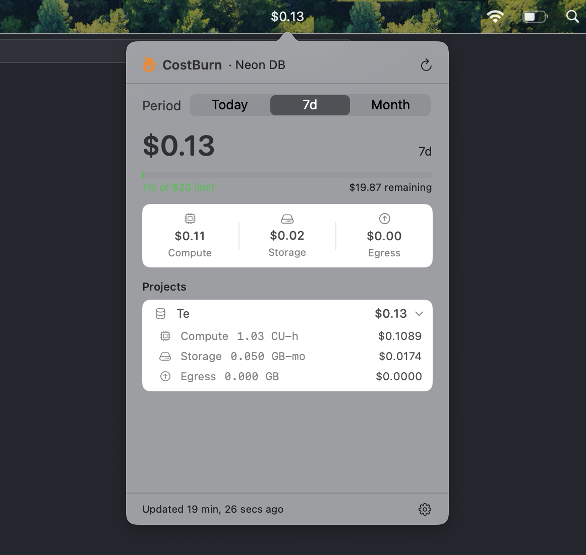

<p align="center"><strong>Costburn: track your spends</strong></p>

<p align="center">
  
</p>

A native macOS menubar app that tracks your [Neon](https://neon.tech) database costs in real time.

```bash
curl -fsSL https://raw.githubusercontent.com/sanjeev-pandey23/costburn/main/install.sh | bash
```

One command — downloads the latest release, installs into `~/Applications`, and launches it. Re-run with `--force` to reinstall.

**Via Homebrew:**
```bash
brew tap sanjeev-pandey23/costburn
brew install --cask costburn
```

---

## What it shows

- Current month spend estimate in the menubar (e.g. `$3.42`)
- Click to expand: compute hours, storage GB-months, egress
- Per-project breakdown (org accounts)
- Daily spend trend chart
- Configurable spend limit with notifications at 80% and 100%
- Launch at login — start automatically when you log in

## Requirements

- macOS 14 (Sonoma) or later
- Neon account on Launch, Scale, or Business plan
- Neon API key (free to generate at `console.neon.tech/app/settings/api-keys`)

## Setup

1. Launch the app — click the `$--.--` icon in your menubar
2. Click the gear icon to open Settings
3. Paste your Neon API key
4. Optionally add your Organization ID for per-project breakdown
5. Choose your plan tier for accurate pricing
6. Enable **Launch at login** so CostBurn starts automatically (macOS will prompt for approval on first enable)

## Pricing accuracy

The app uses Neon's published rates from [https://neon.tech/pricing](https://neon.tech/pricing) and computes estimates from raw usage metrics
(CU-seconds, byte-hours, data transfer bytes). Actual invoiced amounts may differ
slightly due to free-tier allowances, prorations, or plan discounts.
Use **Settings → Custom** to override any per-unit rate.

## Building from source

Requires Xcode 16+ / Swift 6.

```bash
git clone https://github.com/sanjeev-pandey23/costburn
cd costburn
./Scripts/package-app.sh 0.1.0
open .build/CostBurn.app
```

## Releasing

```bash
git tag mac-v0.1.0
git push origin mac-v0.1.0
```

GitHub Actions builds a universal binary (arm64 + x86_64), creates a release,
and updates the Homebrew formula automatically.

## Roadmap

- [ ] v0.2 — Swift Charts daily spend graph
- [ ] v0.3 — Local notifications at spend limits
